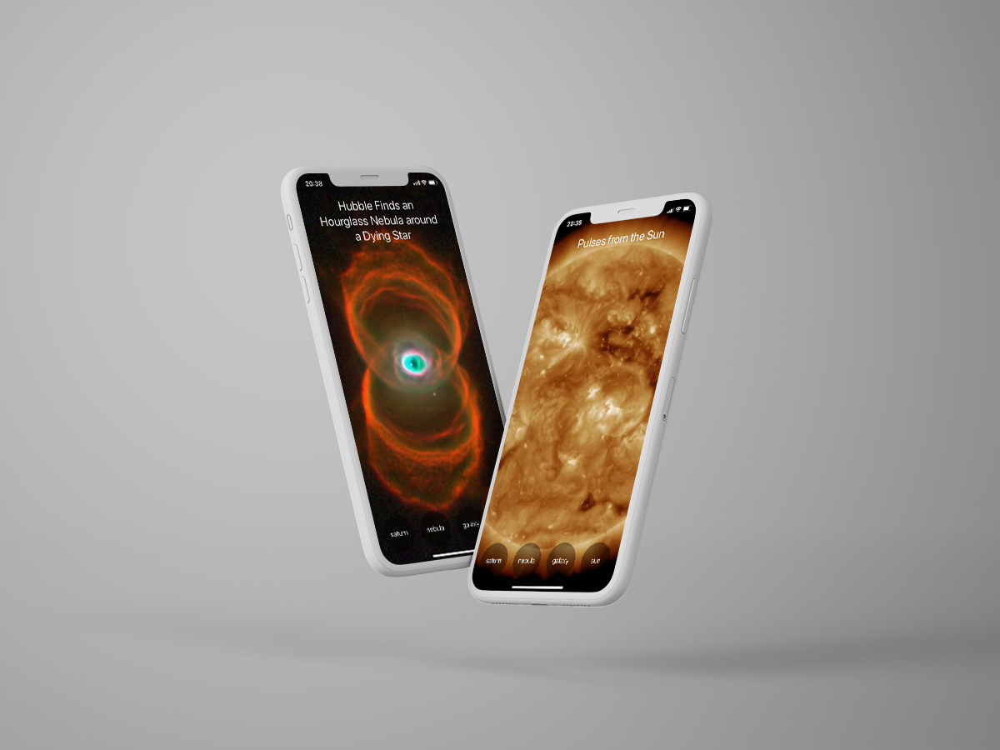

# React Native App - Space Is Cool 📱

An app that randomly generets space images by tapping buttons.

Fetching images and titles with useEffect using NASA API. Styled with styled components.

## Core Tech

- React Native
- NASA API
- Styled Components
- Hooks

## View it live

https://snack.expo.io/@jonnaru/space-is-cool
